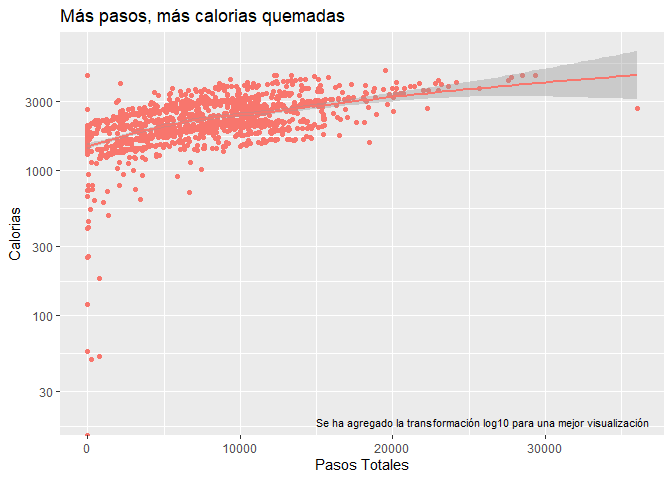
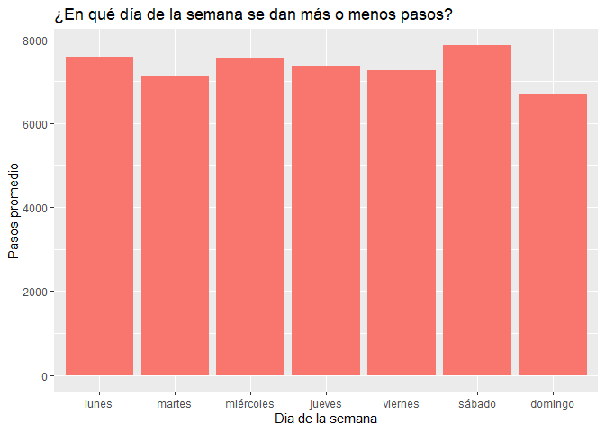
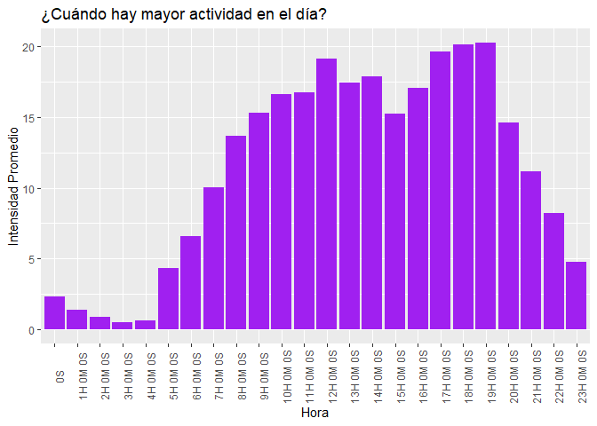
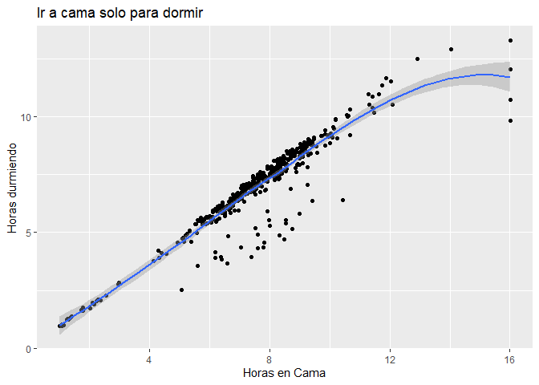

Bellabeat, Analysis Data Proyect
================
Fabián Cornejo, Data analyst
2024-04-03

## About Company

Bellabeat, una empresa de alta tecnología que fabrica productos
inteligentes focalizados en el cuidado de la salud. Desarrolla
tecnología con un bonito diseño que informará e inspirará a las mujeres
de todo el mundo. Recopilar datos sobre la actividad física, el sueño,
el estrés y la salud reproductiva le ha permitido a Bellabeat
proporcionar a las mujeres conocimientos sobre su propia salud y sus
hábitos.

Los productos fabricados por Bellabeat son; *Aplicación Bellabeat*,
*‘Leaf’* dispositivo de seguimiento, *‘Time’* el reloj de beniestar,
*‘Spring’* botella de agua inteligente. Además ofrecen una membresia con
trato y seguimiento especial para los usuarios.

Desde su fundación, en 2013, Bellabeat creció a un ritmo vertiginoso y
rápidamente se posicionó como empresa de bienestar impulsada por la
tecnología para las mujeres.

## Analysis Questions

- ¿Qué tendencias se encuentran en el uso de estos dispositivos
  inteligentes?
- ¿Cómo aplicar dichas tendencias para mejorar el beniestar de los
  clientes?
- ¿Cómo ayudarian estas tendencias a la estrategia de Marketing de la
  empresa?

## Bussines Task. What need we to solve?

La empresa es pequeña pero existosa, necesitamos **encontrar
oportunidades de crecimiento** en los datos y dar **recomendaciones a la
estrategia de Marketing de Bellabeat**. Todo esto basado en las
tendencias de los datos en el uso de los dispositivos inteligentes
vendidos por Bellabeat.

## Cleaning and Processing Data

Los datos son ofrecidos por Amazon. Estan ubicados y son extraídos de
kaggle ‘FitBit Fitness Tracker Data’, expuestos por usuarios de muy alta
visualización comunitaria de la plataforma, *‘Möbius’*. Por lo que son
datos integros, si es cierto que hay problema en la credibilidad de los
datos, donde no siempre mencionan las unidad de medida, en el cual para
este caso fueron descartados dichos datos.

Los archivos correspondientes en el proceso son

- **DailyActivity_merged**: Diferentes tipos de datos relacionados a los
  pasos y distancias recorridas diarias.
- **HourlySteps**: Pasos totales por hora, con su respectivo usuario y
  fecha.
- **info_peso**: Peso de cada usuario con fecha.
- **intensidad_diaria**: Intensidad de cada usuario por fecha y hora;
  liviana, moderada e intensa. También las horas de sedentarismo.
- **SleepDay**: Minutos de sueño y cama de cada usuario por día.
- **Hourly_Intensities**: Actividad por hora.

Todos estos datos nos ayudaran a encontrar relaciones en sus diferentes
factores que nos permitiran entender la salud, beniestar y actividad de
los usarios de Bellabeat.

Además utilizamos lubridate y tidyverse para hacer el proceso de
analisis, bibliotecas aptas para manipular dataframes; como columnas,
nombres, filas, cambiar unidades, fechas, etc.

Importamos librerias

``` r
library(tidyverse)
```

    ## ── Attaching core tidyverse packages ──────────────────────── tidyverse 2.0.0 ──
    ## ✔ dplyr     1.1.4     ✔ readr     2.1.5
    ## ✔ forcats   1.0.0     ✔ stringr   1.5.1
    ## ✔ ggplot2   3.5.0     ✔ tibble    3.2.1
    ## ✔ lubridate 1.9.3     ✔ tidyr     1.3.1
    ## ✔ purrr     1.0.2     
    ## ── Conflicts ────────────────────────────────────────── tidyverse_conflicts() ──
    ## ✖ dplyr::filter() masks stats::filter()
    ## ✖ dplyr::lag()    masks stats::lag()
    ## ℹ Use the conflicted package (<http://conflicted.r-lib.org/>) to force all conflicts to become errors

``` r
library(lubridate)
library(readxl)
```

Limpiamos y procesamos ‘info_emerged’, en este caso tenemos dos archivos
de datos separados el cual necesitamos unir para obtener la completitud
de estos datos, se utiliza R y SQl.

``` r
info_1 <- read.csv('C:\\Yop\\Analisis_de_datos\\Fitabase_Data_1\\Info_merged_1.csv')
str(info_1)
```

    ## 'data.frame':    33 obs. of  8 variables:
    ##  $ Id            : num  1.50e+09 1.93e+09 2.35e+09 2.87e+09 2.87e+09 ...
    ##  $ Date          : chr  "4/5/2016 11:59:59 PM" "4/10/2016 6:33:26 PM" "4/3/2016 11:59:59 PM" "4/6/2016 11:59:59 PM" ...
    ##  $ WeightKg      : num  53.3 129.6 63.4 56.7 57.2 ...
    ##  $ WeightPounds  : num  118 286 140 125 126 ...
    ##  $ Fat           : int  22 NA 10 NA NA NA NA NA NA NA ...
    ##  $ BMI           : num  23 46.2 24.8 21.5 21.6 ...
    ##  $ IsManualReport: chr  "True" "False" "True" "True" ...
    ##  $ LogId         : num  1.46e+12 1.46e+12 1.46e+12 1.46e+12 1.46e+12 ...

``` r
# Eliminamos valores nulos, y escogemos las columnas a utilizar
info_01 <- info_1 %>%
  drop_na() %>%
  distinct() %>%
  separate(Date, into = c("Date", "Hour"), sep = " ") %>% # separamos la hora de las fechas
  select(Id, Date, WeightKg)
```

    ## Warning: Expected 2 pieces. Additional pieces discarded in 2 rows [1, 2].

``` r
str(info_01)
```

    ## 'data.frame':    2 obs. of  3 variables:
    ##  $ Id      : num  1.50e+09 2.35e+09
    ##  $ Date    : chr  "4/5/2016" "4/3/2016"
    ##  $ WeightKg: num  53.3 63.4

``` r
write.csv(info_01, file = "info_1.csv")
```

Hacemos exactamente lo mismo para la info_merged_2. Una vez exportadas
en el pc son trabajadas en SQL. La trabajamos en SQL debido a problemas
con el redondeo tanto en R como en archivo csv.

Aquí seleccionamos y cambiamos los nombres de las columnas. Cambiamos el
tipo de dato character a Date a la fecha, y redondeamos el peso.

*Parse_date*, para seleccionar el tipo de fecha m-d-y

*Replace*, para cambiar/eliminar comillas y nuevamente para cambiar ‘/’
por ‘-’

*Cast*, cambiamos el tipo de dato string a float64

*Round*, para redondear decimales

`SELECT`  
  `__Id__ AS Id,`  
  `PARSE_DATE('%m-%d-%Y', REPLACE((REPLACE(__Date__, '"', '')), '/', '-')) AS Date_,`  
  `ROUND(CAST(REPLACE(__WeightKg___, '"', '') AS float64), 2) AS WeightKg`  
`FROM`  
  `'limpiezas-400601.Proyecto_0.info_1'`  
`ORDER BY`  
`Id, Date ASC`

Lo mismo para info_2.  
Cabe señalar info_1 tiene 33 filas mientras que info_2 tiene 67. Debido
a que ninguna fila se repite, da una totalidad de 100 filas en la union.

Unimos ambas datas en una sola

`SELECT` \*  
`FROM (`  
  `SELECT` \*  
  `FROM` `'Proyecto_0.info_1'`  
  `WHERE Date_ BETWEEN '2016-03-25' AND '2016-04-12'`  
  `UNION ALL`  
  `SELECT` \*  
  `FROM` `'Proyecto_0.info_2'`  
  `WHERE Date_ BETWEEN '2016-04-12' AND '2016-05-12'`  
`) AS info_total`  
`ORDER BY`  
  `Id, Date_ ASC`

En resumen, con SQL procesamos y limpiamos Info_1 e Info_2, luego unimos
en su totalidad con **UNION ALL**.

Limpiamos y procesamos ‘dailyIntensities’ y ‘HourlyIntensities’

``` r
intensidad_diaria <- read.csv('C:\\Yop\\Analisis_de_datos\\Fitabase_Data_2\\dailyIntensities_merged.csv')
str(intensidad_diaria)
```

    ## 'data.frame':    940 obs. of  10 variables:
    ##  $ Id                      : num  1.5e+09 1.5e+09 1.5e+09 1.5e+09 1.5e+09 ...
    ##  $ ActivityDay             : chr  "4/12/2016" "4/13/2016" "4/14/2016" "4/15/2016" ...
    ##  $ SedentaryMinutes        : int  728 776 1218 726 773 539 1149 775 818 838 ...
    ##  $ LightlyActiveMinutes    : int  328 217 181 209 221 164 233 264 205 211 ...
    ##  $ FairlyActiveMinutes     : int  13 19 11 34 10 20 16 31 12 8 ...
    ##  $ VeryActiveMinutes       : int  25 21 30 29 36 38 42 50 28 19 ...
    ##  $ SedentaryActiveDistance : num  0 0 0 0 0 0 0 0 0 0 ...
    ##  $ LightActiveDistance     : num  6.06 4.71 3.91 2.83 5.04 ...
    ##  $ ModeratelyActiveDistance: num  0.55 0.69 0.4 1.26 0.41 ...
    ##  $ VeryActiveDistance      : num  1.88 1.57 2.44 2.14 2.71 ...

``` r
# quitamos valores nulos e iguales, pasamos columnas de minutos a horas y seleccionamos columnas a trabajar
intensidad_diaria <- intensidad_diaria %>%
  drop_na() %>%
  distinct() %>%
  mutate(SedentaryHours = SedentaryMinutes/60,
         LightlyActiveHours = LightlyActiveMinutes/60,
         FairlyActiveHour = FairlyActiveMinutes / 60,
         VeryActiveHour = VeryActiveMinutes / 60) %>%
  select(Id, ActivityDay, SedentaryHours, LightlyActiveHours, 
         FairlyActiveHour, VeryActiveHour)

intensidad_diaria$ActivityDay <- mdy(intensidad_diaria$ActivityDay)
```

hay problemas con la fecha, pero no es preocupación. Es error interno de
libreria que convierte nuestras 00am en NAs, es por aquello que cambio
cada NA en columna hora, a 00:00:00 para que así luego la libreria sea
capaz de reconocer el formato *DATE*. Es decir, no hay problema con la
integridad de los datos, solo un pequeño percanse.

``` r
# hourlyintensities
intensidad_hora1 <- read.csv('C:\\Yop\\Analisis_de_datos\\Fitabase_Data_1\\hourlyIntensities_merged_1.csv')
intensidad_hora2 <- read.csv('C:\\Yop\\Analisis_de_datos\\Fitabase_Data_2\\hourlyIntensities_merged.csv')

intensidad_hora1$ActivityHour =  mdy_hms(intensidad_hora1$ActivityHour, quiet = TRUE)

intensidad_hora1 <- separate(intensidad_hora1, ActivityHour, into = c("Date", "Hour"), sep = " ")
```

    ## Warning: Expected 2 pieces. Missing pieces filled with `NA` in 1021 rows [1, 25, 49, 73,
    ## 97, 121, 145, 169, 193, 217, 241, 265, 289, 313, 337, 361, 385, 409, 433, 457,
    ## ...].

``` r
intensidad_hora1$Hour[is.na(intensidad_hora1$Hour)] <- "00:00:00"
view(intensidad_hora1)

intensidad_hora2$ActivityHour =  mdy_hms(intensidad_hora2$ActivityHour, quiet = TRUE)
intensidad_hora2 <- separate(intensidad_hora2, ActivityHour, into = c("Date", "Hour"), sep = " ")
```

    ## Warning: Expected 2 pieces. Missing pieces filled with `NA` in 934 rows [1, 25, 49, 73,
    ## 97, 121, 145, 169, 193, 217, 241, 265, 289, 313, 337, 361, 385, 409, 433, 457,
    ## ...].

``` r
intensidad_hora2$Hour[is.na(intensidad_hora2$Hour)] <- "00:00:00"
view(intensidad_hora2)


intensidad_hora_total <- merge(x = intensidad_hora1, y = intensidad_hora2, all = TRUE) %>%
  distinct()
```

Terminamos de limpiar y procesar el resto de archivos (de manera análoga
a lo que ya vimos).

## Data analysis

Cargamos los nuevos conjuntos de datos procesados

``` r
Daily_Activity <- read.csv('C:\\Yop\\Analisis_de_datos\\Data unida - codigos SQL\\dailyactivity_merged_total.csv')
Hourly_Steps <- read.csv('C:\\Yop\\Analisis_de_datos\\Data unida - codigos SQL\\HourlySteps.csv')
Peso <- read.csv('C:\\Yop\\Analisis_de_datos\\Data unida - codigos SQL\\Info_peso.csv')
Intensidad_diaria <- read.csv('C:\\Yop\\Analisis_de_datos\\Data unida - codigos SQL\\Intensidad_diaria.csv')
Sleep_Day <- read.csv('C:\\Yop\\Analisis_de_datos\\Data unida - codigos SQL\\SleepDay.csv')

# Procesamos y analizamos Daily activity

str(Daily_Activity)
```

    ## 'data.frame':    1371 obs. of  15 variables:
    ##  $ Id                      : num  1.5e+09 1.5e+09 1.5e+09 1.5e+09 1.5e+09 ...
    ##  $ ActivityDate            : chr  "2016-03-25" "2016-03-26" "2016-03-27" "2016-03-28" ...
    ##  $ TotalSteps              : int  11004 17609 12736 13231 12041 10970 12256 12262 11248 10016 ...
    ##  $ TotalDistance           : num  7.11 11.55 8.53 8.93 7.85 ...
    ##  $ TrackerDistance         : num  7.11 11.55 8.53 8.93 7.85 ...
    ##  $ LoggedActivitiesDistance: num  0 0 0 0 0 0 0 0 0 0 ...
    ##  $ VeryActiveDistance      : num  2.57 6.92 4.66 3.19 2.16 ...
    ##  $ ModeratelyActiveDistance: num  0.46 0.73 0.16 0.79 1.09 ...
    ##  $ LightActiveDistance     : num  4.07 3.91 3.71 4.95 4.61 ...
    ##  $ SedentaryActiveDistance : num  0 0 0 0 0 0 0 0 0 0 ...
    ##  $ VeryActiveMinutes       : int  33 89 56 39 28 30 33 47 40 15 ...
    ##  $ FairlyActiveMinutes     : int  12 17 5 20 28 13 12 21 11 30 ...
    ##  $ LightlyActiveMinutes    : int  205 274 268 224 243 223 239 200 244 314 ...
    ##  $ SedentaryMinutes        : int  804 588 605 1080 763 1174 820 866 636 655 ...
    ##  $ Calories                : int  1819 2154 1944 1932 1886 1820 1889 1868 1843 1850 ...

``` r
n_distinct(Daily_Activity$Id)
```

    ## [1] 35

``` r
n_distinct(Peso$Id)
```

    ## [1] 13

``` r
n_distinct(Intensidad_diaria$Id)
```

    ## [1] 33

``` r
n_distinct(Sleep_Day$Id)
```

    ## [1] 24

``` r
n_distinct(Hourly_Steps$Id)
```

    ## [1] 35

Lamentablemente los usuarios del conjunto ‘Peso’ no logran ser ni la
mitad de la mayoria de los conjuntos, por lo tanto no son significantes
para el estudio.

``` r
Daily_Activity <- select(Daily_Activity, Id, ActivityDate, TotalSteps,
                         SedentaryMinutes, Calories)

# Por alguna razón csv convierte Date a character, volvemos a cambiar el tipo de dato
Daily_Activity$ActivityDate <- ymd(Daily_Activity$ActivityDate)
#detectamos los dias y los agregamos a una nueva columna
Daily_Activity$dia_semana <- weekdays(Daily_Activity$ActivityDate)

#agregamos un factor de orden 
dias_semana <- c("lunes", "martes", "miércoles", "jueves", "viernes", "sábado",
                 "domingo")
Daily_Activity$dia_semana <- factor(Daily_Activity$dia_semana, levels = dias_semana)

promedio_activity <- Daily_Activity %>%
  group_by(dia_semana) %>%
  summarise(Pasos_promedio = mean(TotalSteps),
            Calorias_promedios = mean(Calories))

## sleep day
Sleep_Day <- Sleep_Day %>%
  select( Id, Date, MinutesSleep, TimeInBed) %>%
  rename(Horas_durmiendo = MinutesSleep,
         Horas_en_cama = TimeInBed) %>%
  group_by(Id) %>%
  arrange(Id)

## hourly steps
Hourly_Steps <- select(Hourly_Steps, Id, Date, Hour, StepTotal)
Intensidad_diaria <- select(Intensidad_diaria, Id, ActivityDay, 
                            SedentaryHours, LightlyActiveHours, 
                            FairlyActiveHour, VeryActiveHour)
## Hourly Intensity 

# Nuevamente es irreconocible la fecha y hora, se soluciona y luego se pasan nuevamente a caracteres, con el fin de que quede ordenado y hacer graficos precisos a futuro
intensidad_hora_total$Date <- ymd(intensidad_hora_total$Date)
intensidad_hora_total$Hour <- hms(intensidad_hora_total$Hour)
intensidad_hora_total$Hour <- as.character(intensidad_hora_total$Hour)


summary(Daily_Activity)
```

    ##        Id             ActivityDate          TotalSteps    SedentaryMinutes
    ##  Min.   :1.504e+09   Min.   :2016-03-25   Min.   :    0   Min.   :   0.0  
    ##  1st Qu.:2.320e+09   1st Qu.:2016-04-09   1st Qu.: 3222   1st Qu.: 728.0  
    ##  Median :4.445e+09   Median :2016-04-19   Median : 7114   Median :1055.0  
    ##  Mean   :4.795e+09   Mean   :2016-04-19   Mean   : 7341   Mean   : 987.2  
    ##  3rd Qu.:6.962e+09   3rd Qu.:2016-04-30   3rd Qu.:10634   3rd Qu.:1237.0  
    ##  Max.   :8.878e+09   Max.   :2016-05-12   Max.   :36019   Max.   :1440.0  
    ##                                                                           
    ##     Calories        dia_semana 
    ##  Min.   :   0   lunes    :184  
    ##  1st Qu.:1799   martes   :221  
    ##  Median :2113   miércoles:194  
    ##  Mean   :2262   jueves   :191  
    ##  3rd Qu.:2764   viernes  :197  
    ##  Max.   :4900   sábado   :195  
    ##                 domingo  :189

``` r
summary(Sleep_Day)
```

    ##        Id                Date           Horas_durmiendo   Horas_en_cama   
    ##  Min.   :1.504e+09   Length:413         Min.   : 0.9667   Min.   : 1.017  
    ##  1st Qu.:3.977e+09   Class :character   1st Qu.: 6.0167   1st Qu.: 6.717  
    ##  Median :4.703e+09   Mode  :character   Median : 7.2167   Median : 7.717  
    ##  Mean   :5.001e+09                      Mean   : 6.9911   Mean   : 7.644  
    ##  3rd Qu.:6.962e+09                      3rd Qu.: 8.1667   3rd Qu.: 8.767  
    ##  Max.   :8.792e+09                      Max.   :13.2667   Max.   :16.017

``` r
summary(Hourly_Steps)
```

    ##        Id                Date               Hour             StepTotal      
    ##  Min.   :1.504e+09   Length:46008       Length:46008       Min.   :    0.0  
    ##  1st Qu.:2.320e+09   Class :character   Class :character   1st Qu.:    0.0  
    ##  Median :4.559e+09   Mode  :character   Mode  :character   Median :   21.0  
    ##  Mean   :4.870e+09                                         Mean   :  302.9  
    ##  3rd Qu.:6.962e+09                                         3rd Qu.:  323.0  
    ##  Max.   :8.878e+09                                         Max.   :10565.0

``` r
summary(Intensidad_diaria)
```

    ##        Id            ActivityDay        SedentaryHours  LightlyActiveHours
    ##  Min.   :1.504e+09   Length:940         Min.   : 0.00   Min.   :0.000     
    ##  1st Qu.:2.320e+09   Class :character   1st Qu.:12.16   1st Qu.:2.117     
    ##  Median :4.445e+09   Mode  :character   Median :17.62   Median :3.317     
    ##  Mean   :4.855e+09                      Mean   :16.52   Mean   :3.214     
    ##  3rd Qu.:6.962e+09                      3rd Qu.:20.49   3rd Qu.:4.400     
    ##  Max.   :8.878e+09                      Max.   :24.00   Max.   :8.633     
    ##  FairlyActiveHour VeryActiveHour   
    ##  Min.   :0.0000   Min.   :0.00000  
    ##  1st Qu.:0.0000   1st Qu.:0.00000  
    ##  Median :0.1000   Median :0.06667  
    ##  Mean   :0.2261   Mean   :0.35275  
    ##  3rd Qu.:0.3167   3rd Qu.:0.53333  
    ##  Max.   :2.3833   Max.   :3.50000

Con las librerias pudimos seleccionar todo lo necesario y organizarla de
manera optima para nuestro analisis, formateamos el tipo de datos a los
necesarios/debidos, que para este caso practico fueron las fechas.

#### Interesting Data

- El promedio de 7300 pasos esta por debajo de lo recomendado por la
  OMS, para una vida activa se recomiendan 10.000 pasos diarios minimo.
- El promedio de horas dormidas esta al borde de lo minimo diario para
  cada persona, *National Sleep Foundation* recomienda dormir entre 7-9
  horas. Las horas en cama no se distancian mucho de estos resultados.
  Hay una/s persona/s que ha dormido como mínimo y máximo afuera de lo
  recomendado, 1 hora y 13horas, respectivamente.
- Las horas de sedentarismo en promedio son de 16 horas, es decir, que
  al menos hay 9 horas de sedentarismo activo. Ya que claramente no se
  puede ser activo en las horas de sueño. Las personas suelen ser
  ligeramente activas con un promedio de 3 horas y 12 minutos. La
  actividad promedio moderada e intensa suman un total de 30min diarios.

## Visualization

``` r
ggplot(Daily_Activity, aes(x = TotalSteps, y = Calories, colour = 'orange')) +
  geom_point()  + geom_smooth() +
  labs(title = 'Más pasos, más calorias quemadas', x = 'Pasos Totales', y = 'Calorias') +
  theme(legend.position = "none") +
  scale_y_continuous(trans = "log10") + 
  annotate("text", x = 15000, y = 20, label = 'Se ha agregado la transformación log10 para una mejor visualización', hjust = 0, vjust = 1, size = 3, color = "black")
```

    ## Warning in scale_y_continuous(trans = "log10"): log-10 transformation introduced infinite values.
    ## log-10 transformation introduced infinite values.

    ## `geom_smooth()` using method = 'gam' and formula = 'y ~ s(x, bs = "cs")'

    ## Warning: Removed 9 rows containing non-finite outside the scale range
    ## (`stat_smooth()`).

<!-- -->

``` r
ggplot(data = promedio_activity, aes(x = dia_semana, y = Pasos_promedio, fill = 'orange')) + 
  geom_bar(stat = 'identity') +
  theme(axis.text.x = element_text(angle = 0), legend.position = "none") +
  labs(x = "Dia de la semana" , y = "Pasos promedio", 
       title="¿En qué día de la semana se dan más o menos pasos?")
```

<!-- -->

Aunque obvio, se confirma que entre más pasos mayor calorias son
quemadas/eliminadas. Además los pasos promedio son estables todos los
dias, sin importar si es dia trabajable o fin de semana, esto muestra
una tendencia de sedentarismo antes que otro factor.  
**Si los usuarios quieren revertir el sedentarismo se podria recomendar
salir a caminar/quemar calorias, en los aparatos inteligentes de
Bellbeat con una notificación diaría o propuesta por el mismo usuario.**

``` r
# damos un factor de orden, así el grafico esta en orden
intensidad_hora_total$Hour <- factor(intensidad_hora_total$Hour, levels = c("0S", "1H 0M 0S",
                                                          '2H 0M 0S',
                                                          "3H 0M 0S",
                                                          "4H 0M 0S", 
                                                          "5H 0M 0S", "6H 0M 0S", 
                                                          "7H 0M 0S", "8H 0M 0S", 
                                                          "9H 0M 0S", "10H 0M 0S",
                                                          "11H 0M 0S", "12H 0M 0S",
                                                          "13H 0M 0S", "14H 0M 0S",
                                                          "15H 0M 0S", "16H 0M 0S",
                                                          "17H 0M 0S", "18H 0M 0S",
                                                          "19H 0M 0S", "20H 0M 0S",
                                                          "21H 0M 0S", "22H 0M 0S",
                                                          "23H 0M 0S", "24H 0M 0S"))

Intensidad_hora <- intensidad_hora_total %>%
  group_by(Hour) %>%
  summarise(TotalIntensity_promedio = mean(TotalIntensity))

ggplot(data = Intensidad_hora, aes(x = Hour, y = TotalIntensity_promedio)) +
  geom_bar(stat = "identity", fill='purple') +
  theme(axis.text.x = element_text(angle = 90)) +
  labs(title="¿Cuándo hay mayor actividad en el día?", x = 'Hora', y = 'Intensidad Promedio')
```

<!-- -->

Para ser aun mas exactos, podemos observar que la **mayor intensidad se
da entre las 17 y 19 horas**. Momento donde **se podrian enviar
notificaciones a los usuarios para recordarles salir a caminar o hacer
ejercicio**. Momento ideal debido a que son horas donde la gente esta
mayormente disponible, han termindo los quehaceres/trabajos del día.

``` r
ggplot(Sleep_Day, aes(x = Horas_en_cama, y = Horas_durmiendo)) + 
  geom_point()  + geom_smooth() +
  labs(title = 'Ir a cama solo para dormir', x = "Horas en Cama", 
       y = "Horas durmiendo")
```

    ## `geom_smooth()` using method = 'loess' and formula = 'y ~ x'

<!-- -->

La relación entre ambos es lineal, tiempo en cama es practicamente
tiempo durmiendo. Se podria **considerar usar una notificación para ir a
la cama, asi mejorar el estado de sueño**, ya que el minimo de horas
promedio para dormir estaba en su limite.

## Conclusion and Recommendations

Hemos recolectado información de los datos proporcionados por los
aparatos inteligentes de Bellbeat, donde se muestran los habitos y así
también la salud de los participantes. Con esto podemos dar algunas
recomendaciones para mejorar los aparatos y asi en consecuencia hacer
crecer aun más la empresa, es decir, recomendaciones que puedan ayudar a
la estrategia de marketing de Bellbeat.

Antes cabe señalar que el objetivo de audencia va inclinado hacia
mujeres por parte de la empresa, pero no así el estudio. No hay
información de géneros ni tampoco de algun grupo etario. Se asume que es
para toda persona y edad (hasta incluidos enfermos cronicos).

Entonces, la audencia es mayoritariamente sedentaria con alrededor de
8mil pasos diarios, y para una vida saludable es necesario 10mil. Además
mayoritariamente son ligeramente activas, es necesario aumentar la
actividad moderada e intensa. Con los datos obtenidos, podemos confirmar
que el sedentarismo no es por falta de tiempo. Ahora bien los indices de
sueño estan al borde, por el cual es necesario aumentar las horas de
sueño.

Por lo tanto, podemos recomendar

- Si los usuarios desean revertir el sedentarismo o mantenerse
  saludable, se podria recomendar a los usuarios activar cumplir una
  cuota diaria de pasos, como mínimo los 10.000 recomendados por la OMS.
  Esto con el aparato “Time”, el reloj inteligente. Así como también
  avisar si estan siendo demasiado sedentarios, tener un limite de pasos
  minimos apróx 6.000.

- Se podria agregar una notificación de recordatorio de hacer ejercicio
  entre las 17:00 hrs y 19:00 hrs, donde mayoritariamente es cuando hay
  mayor actividad intensa en el día, ideal cuando la gente no esta en el
  trabajo o sin quehaceres cotidianos. A través del aparato “Leaf” para
  el seguimiento de la actividad física. Sumado a este punto, el aparato
  “spring” (la botella inteligente) podria recomendar hidratarse en
  algun momento de las horas recientemente señaladas.

- Confirmamos que estar en cama es proporcional de manera lineal a
  dormir, como las horas de sueño esta un poco por debajo a lo esperado,
  seria recomendable activar notificaciones “go to sleep” para poder
  mejorar estas horas de sueño. A demás con la membresia de Bellbeat,
  dar recomendaciones y consejos de como mejorar el tiempo para poder
  quedarse dormido, ya que hay un áproximado de 30 minutos en que las
  personas estan quedandose dormidas.

Finalmente, de manera generaliza, dar objetivos a través de
notificaciones en los dispositivos inteligentes es una gran ayuda para
incentivar a los usuarios a ser menos sedentarios, tener un mejor
beniestar y salud en general. Así también atraer nuevos usuarios con
todas las nuevas funciones de los dispositivos inteligentes de Bellbeat!

Thanks u for watching and reading my BellBeat case proyect with R :)
